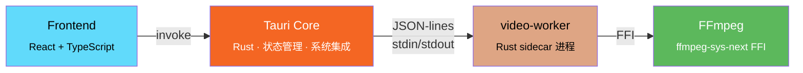

# countDelay-rs

[English](docs/en/README.md)

**countDelay-rs** 是一个 Windows 桌面应用，用于逐帧测量视频中的触发-响应延迟（trigger-to-response latency）。通过打开本地视频文件、逐帧步进、用快捷键标记触发帧和响应帧，基于真实 PTS 时间戳计算精确延迟。

基于 Tauri v2 + React 19 + Rust + FFmpeg 构建。


## 功能特性

- 打开本地视频文件，显示视频信息（分辨率、编码、帧率、总帧数、时长）
- 逐帧步进浏览，支持 ±1 / ±10 / -100 帧跳转
- 快捷键标记触发帧和响应帧，自动计算延迟（毫秒）
- 基于真实 PTS 时间戳计算，而非 `帧号/帧率`，精度更高
- 测量结果表格，支持删除和均值计算
- 一键复制结果表格到剪贴板

## 快捷键

| 按键 | 功能 |
|------|------|
| `A` / `D` | 前/后 ±1 帧 |
| `Z` / `C` | 前/后 ±10 帧 |
| `X` | 后退 100 帧 |
| `Space` | 标记触发帧 / 响应帧 |
| `S` | 删除末行 |
| `Q` | 计算均值 |
| `Ctrl+C` | 复制结果表格 |

## 技术架构



| 层级 | 目录 | 职责 |
|------|------|------|
| **前端** | `src/` | React + TypeScript UI，快捷键，测量表格 |
| **Tauri 核心层** | `src-tauri/src/` | Tauri commands，应用状态，sidecar 生命周期，系统集成 |
| **video-worker** | `src-tauri/video-worker/` | 独立 sidecar 进程，直接链接 FFmpeg，进程隔离防止崩溃影响 UI |

## 构建与开发

### 前置要求

- [Rust](https://rustup.rs/) 工具链（MSVC target）
- [Node.js](https://nodejs.org/) + [pnpm](https://pnpm.io/)
- [LLVM/libclang](https://releases.llvm.org/)（`ffmpeg-sys-next` bindgen 需要）

### 开发模式

```bash
# 安装前端依赖
pnpm install

# 验证内置的 FFmpeg SDK 布局
pnpm verify:ffmpeg-sdk

# 构建 video-worker sidecar
pnpm build:sidecar

# 启动开发模式（构建 sidecar + 启动 Vite + Tauri 窗口）
pnpm tauri dev
```

### 生产构建

```bash
# 完整生产构建（前端 + sidecar + 安装包）
pnpm tauri build
```

### 运行测试

```bash
# 全部 Rust 测试（Tauri 核心层 + video-worker）
cargo test --manifest-path src-tauri/Cargo.toml

# 仅 video-worker 测试
cargo test -p video-worker

# 单个测试（带输出）
cargo test -p video-worker -- --nocapture test_name
```

> **注意：** 项目没有根级 `Cargo.toml` workspace。Rust 入口是 `src-tauri/Cargo.toml`，从仓库根目录运行 cargo 命令时需加 `--manifest-path src-tauri/Cargo.toml`。

## FFmpeg 集成

- **内置 SDK：** `third_party/ffmpeg/windows-x86_64/`（v8.0.1, GPL v3）
- **环境变量：** `FFMPEG_DIR` 在 `.cargo/config.toml` 中配置，供 `ffmpeg-sys-next` 使用
- 构建脚本会自动将所需 DLL 复制到输出目录

## 推荐 IDE 配置

- [VS Code](https://code.visualstudio.com/) + [Tauri](https://marketplace.visualstudio.com/items?itemName=tauri-apps.tauri-vscode) + [rust-analyzer](https://marketplace.visualstudio.com/items?itemName=rust-lang.rust-analyzer)

## 致谢

本项目是一个 vibe coding 产物，借助 [Claude Code](https://claude.ai/code) 完成开发。

## 许可证

本项目基于 [GPL-3.0](LICENSE) 许可证开源。
