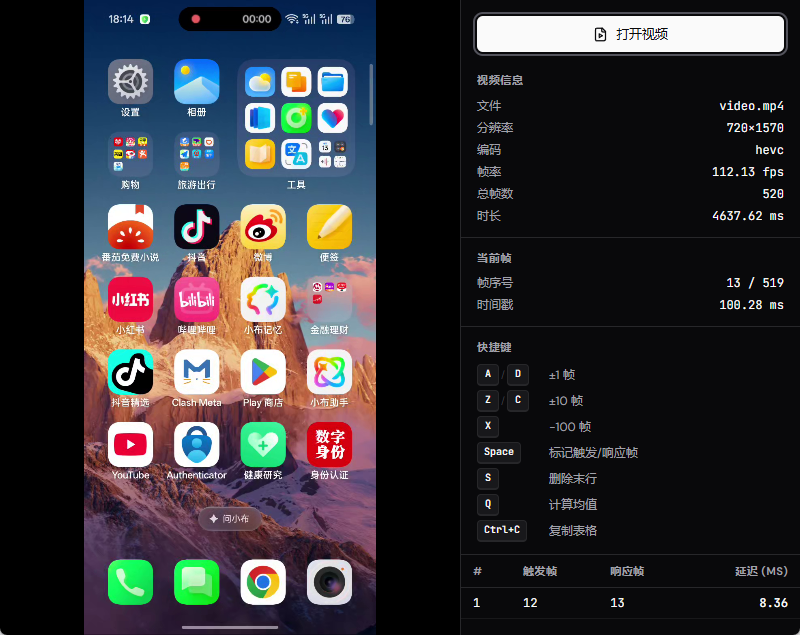
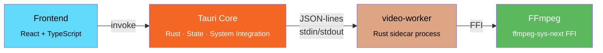

# countDelay-rs

[中文](../../README.md)

**countDelay-rs** is a Windows desktop application for measuring frame-level trigger-to-response latency in video. Open a local video file, step through frames, mark trigger and response frames with keyboard hotkeys, and compute precise delay from real PTS timestamps.

Built with Tauri v2 + React 19 + Rust + FFmpeg.



## Features

- Open local video files with full metadata display (resolution, codec, frame rate, total frames, duration)
- Frame-by-frame stepping with ±1 / ±10 / -100 frame jumps
- Hotkey-based trigger/response frame marking with automatic delay calculation (ms)
- PTS-based timing (not `frame_number / fps`) for higher accuracy
- Measurement result table with row deletion and mean calculation
- One-click copy of result table to clipboard

## Hotkeys

| Key | Action |
|-----|--------|
| `A` / `D` | Step ±1 frame |
| `Z` / `C` | Step ±10 frames |
| `X` | Step -100 frames |
| `Space` | Mark trigger / response frame |
| `S` | Delete last row |
| `Q` | Calculate mean |
| `Ctrl+C` | Copy result table |

## Architecture



| Layer | Directory | Responsibility |
|-------|-----------|----------------|
| **Frontend** | `src/` | React + TypeScript UI, hotkeys, measurement table |
| **Tauri Core** | `src-tauri/src/` | Tauri commands, app state, sidecar lifecycle, system integration |
| **video-worker** | `src-tauri/video-worker/` | Standalone sidecar process, links FFmpeg directly, process isolation prevents crashes from affecting UI |

## Build & Development

### Prerequisites

- [Rust](https://rustup.rs/) toolchain (MSVC target)
- [Node.js](https://nodejs.org/) + [pnpm](https://pnpm.io/)
- [LLVM/libclang](https://releases.llvm.org/) (required by `ffmpeg-sys-next` bindgen)

### Development

```bash
# Install frontend dependencies
pnpm install

# Validate vendored FFmpeg SDK layout
pnpm verify:ffmpeg-sdk

# Build the video-worker sidecar
pnpm build:sidecar

# Start dev mode (builds sidecar + starts Vite + Tauri window)
pnpm tauri dev
```

### Production Build

```bash
# Full production build (frontend + sidecar + installer)
pnpm tauri build
```

### Running Tests

```bash
# All Rust tests (Tauri core + video-worker)
cargo test --manifest-path src-tauri/Cargo.toml

# Video-worker tests only
cargo test -p video-worker

# Single test with output
cargo test -p video-worker -- --nocapture test_name
```

> **Note:** There is no root-level `Cargo.toml` workspace. The Rust entry point is `src-tauri/Cargo.toml`. Always use `--manifest-path src-tauri/Cargo.toml` when running cargo commands from the repo root.

## FFmpeg Integration

- **Vendored SDK:** `third_party/ffmpeg/windows-x86_64/` (v8.0.1, GPL v3)
- **Environment:** `FFMPEG_DIR` is set in `.cargo/config.toml`, consumed by `ffmpeg-sys-next`
- Build scripts automatically copy required DLLs to output directories

## Recommended IDE Setup

- [VS Code](https://code.visualstudio.com/) + [Tauri](https://marketplace.visualstudio.com/items?itemName=tauri-apps.tauri-vscode) + [rust-analyzer](https://marketplace.visualstudio.com/items?itemName=rust-lang.rust-analyzer)

## Acknowledgements

This project is a vibe coding product, built with [Claude Code](https://claude.ai/code).

## License

FFmpeg components are licensed under GPL v3.
